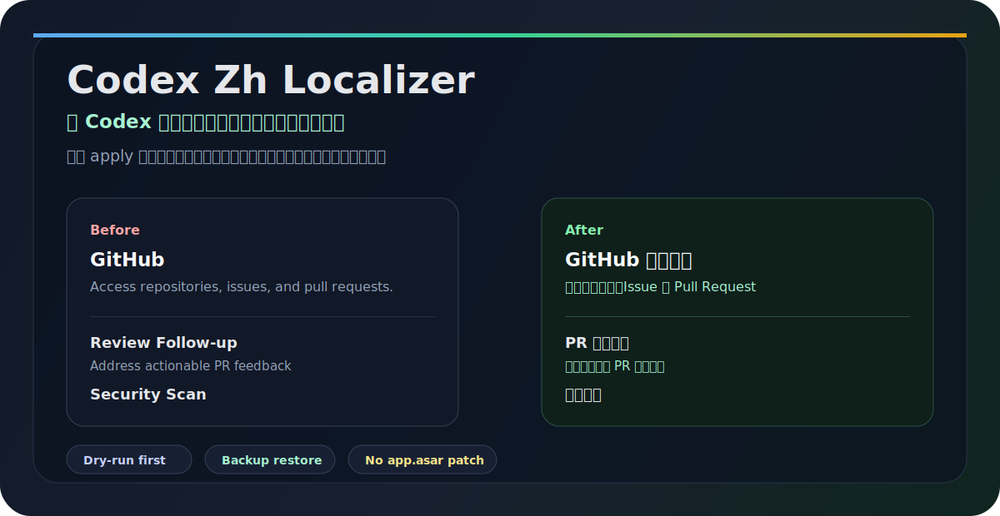

# Codex Zh Localizer / Codex 中文化工具

**简体中文** | [English](README.en.md)

[](LICENSE)


Codex Zh Localizer 是一个非官方的 OpenAI Codex 中文化 CLI，用来把 Codex 插件市场、插件详情页技能、应用连接器说明转换成简体中文。它只处理可恢复的本地插件元数据缓存，不修改 Codex App 本体。

适合搜索“Codex 中文化”“Codex 插件市场中文”“OpenAI Codex 中文插件”“Codex plugin marketplace localization”的用户。



```bash
npx --yes github:flag0x369/codex-zh-localizer dry-run
npx --yes github:flag0x369/codex-zh-localizer apply
```

## 解决什么问题

Codex 插件越来越多，但插件名、技能说明、应用连接器描述经常还是英文。这个工具让插件市场从“能看到”变成“看得懂”，同时保持安全边界清楚。

| 你遇到的问题 | 这个工具做什么 |
| --- | --- |
| 插件市场卡片英文太多 | 中文化插件名、简介、详情和示例提示词 |
| 插件详情页技能看不懂 | 中文化技能名、技能描述和默认提示词 |
| 应用连接器说明还是英文 | 中文化应用名和连接器描述 |
| Codex 更新后中文又没了 | 重新运行 `apply`，幂等恢复支持范围内的中文 |
| 担心影响 Codex | 默认 dry-run，每次写入前备份，支持 restore |

## 30 秒开始

先看会改什么，不写入：

```bash
npx --yes github:flag0x369/codex-zh-localizer dry-run
npx --yes github:flag0x369/codex-zh-localizer audit --strict
```

确认后应用中文化：

```bash
npx --yes github:flag0x369/codex-zh-localizer apply
```

从源码运行：

```bash
git clone https://github.com/flag0x369/codex-zh-localizer.git
cd codex-zh-localizer
npm run dry-run
npm run apply
```

Codex 更新或插件缓存刷新后，再跑一次：

```bash
npx --yes github:flag0x369/codex-zh-localizer apply
```

## 效果范围

| 目标 | 是否支持 | 说明 |
| --- | --- | --- |
| 插件市场卡片 | 支持 | `plugin.json` 和 marketplace JSON |
| 插件详情页技能 | 支持 | `skills/*/agents/openai.yaml` |
| 插件详情页应用 | 支持 | app connector directory cache |
| Codex 前端内置按钮和菜单 | 暂不支持 | 这些通常在 App bundle / `app.asar` 内 |
| 品牌名、命令、API key | 保留原文 | 避免误伤可识别名称和配置项 |

本机审计样例：

```text
pluginJson: 190/190 已中文化
marketplaceJson: 3/3 已中文化
skillYaml: 563/563 已中文化
appConnectors: 140/140 已中文化
```

## 常用命令

```bash
# 只读审计
npx --yes github:flag0x369/codex-zh-localizer audit

# dry-run，不写文件
npx --yes github:flag0x369/codex-zh-localizer dry-run

# 应用中文化
npx --yes github:flag0x369/codex-zh-localizer apply

# 恢复最近一次插件卡片补丁
npx --yes github:flag0x369/codex-zh-localizer restore-marketplace latest

# 恢复最近一次详情组件补丁
npx --yes github:flag0x369/codex-zh-localizer restore-components latest
```

高级用法：

```bash
# 对临时 HOME 测试，不碰真实 ~/.codex
npx --yes github:flag0x369/codex-zh-localizer apply --home /tmp/fake-home --backup-root /tmp/codex-zh-backups

# 用于 CI 或本地检查，发现待中文化项时退出非 0
npx --yes github:flag0x369/codex-zh-localizer audit --strict
```

## 安全边界

这个工具默认不做这些事：

| 不做 | 原因 |
| --- | --- |
| 不修改 `/Applications/Codex.app` | 避免破坏 App 签名和更新 |
| 不修改 `app.asar` | 避免影响完整性校验 |
| 不读取 token、cookie、私钥、密码 | 不接触用户凭据 |
| 不安装后台常驻进程 | 不默认写入 LaunchAgent、cron、shell hook |
| 不翻译品牌名和命令 | 避免破坏可识别名称和配置 |

每次 `apply` 前都会创建备份，`restore-marketplace` 和 `restore-components` 会按补丁类型恢复，避免串台。

## 为什么不直接改 app.asar

Codex 前端内置 UI 文案位于 App bundle 资源中，其中包括 `app.asar`。直接 patch App 本体可能影响 macOS App 签名、Codex 自动更新、完整性校验和下次升级后的可恢复性。

当前版本选择更稳的路线：只中文化插件市场、技能和应用连接器这些可恢复的本地元数据。

## FAQ

### 这是不是官方语言包？

不是。这是非官方本地工具，目标是安全中文化 Codex 插件相关元数据。

### Codex 更新后还会保持中文吗？

如果 Codex 更新刷新了插件缓存，中文可能被覆盖。重新运行 `apply` 即可恢复支持范围内的中文。

### 会不会影响 Codex 正常运行？

工具默认 dry-run，不写文件。真正写入时只改本地插件元数据缓存，并且先备份。不会修改 Codex App 本体。

### 可以恢复吗？

可以：

```bash
npx --yes github:flag0x369/codex-zh-localizer restore-marketplace latest
npx --yes github:flag0x369/codex-zh-localizer restore-components latest
```

### 为什么有些地方仍然是英文？

品牌名、命令、API 名、路径、配置 key 会保留英文。Codex 前端内置 UI 或远端文案也不在当前安全支持范围内。

## 本地开发

```bash
npm run check
npm run smoke
npm run audit -- --strict
```

`npm run smoke` 会创建临时 HOME，完整验证 apply、audit、restore，不会触碰真实 `~/.codex`。

## 贡献翻译

欢迎提交 PR 改进翻译。请遵守：

- 品牌名、API 名、命令、路径、配置 key 保持原文
- 新增翻译规则后运行 `npm run smoke`
- 正则规则要避免误伤品牌词
- 新增目标路径时必须说明为什么安全、如何备份、如何恢复

## 免责声明

这是非官方工具，不是 OpenAI 官方语言包。Codex 更新可能改变缓存结构。如果审计发现待处理项，先重新运行 `apply`，仍有问题再提交 issue。
